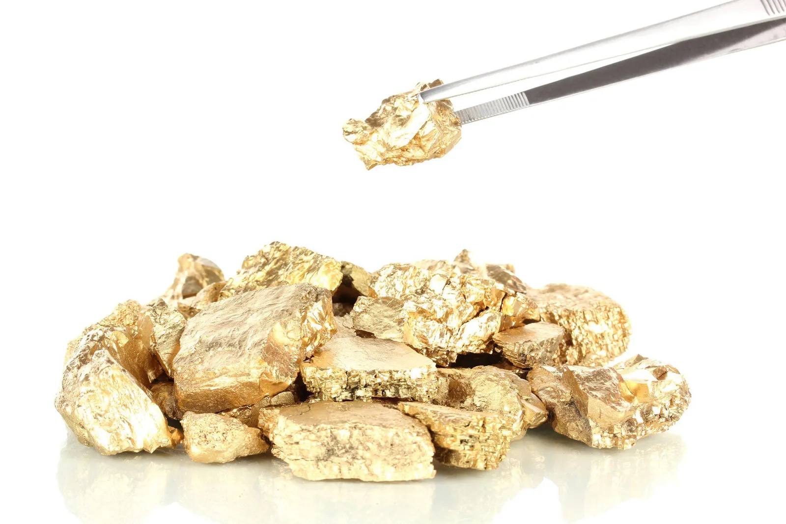

# Gold Extraction Project

## Overview

This project focuses on the extraction of gold from ore using data-driven methods and machine learning techniques. The goal is to optimize the extraction process and maximize the yield of gold.

## Project Structure

The project consists of the following main components:

- **Data Preparation:** The project starts with the collection of relevant data related to the gold extraction process.

- **Exploratory Data Analysis (EDA):** Data is thoroughly explored to gain insights into the variables and their relationships.

- **Feature Engineering:** New features are created, and data is preprocessed to prepare it for modeling.

- **Modeling:** Various machine learning models, including Linear Regression, Random Forest Regressor, and Decision Tree Regressor, are employed to predict gold extraction outcomes.

- **Hyperparameter Tuning:** GridSearchCV is used for hyperparameter tuning to improve model performance.

- **Model Evaluation:** The models are evaluated using appropriate metrics, including sMAPE (Symmetric Mean Absolute Percentage Error).

- **Results:** The project aims to achieve optimal gold extraction results by identifying the best-performing model.

## Requirements

To run the project, you'll need the following Python libraries:

- pandas
- scikit-learn
- numpy
- seaborn
- matplotlib

You can install these libraries using the following command:

pip install pandas scikit-learn numpy seaborn matplotlib

## Usage

1. Clone this repository to your local machine.
2. Install the required Python libraries as mentioned above.
3. Run the Jupyter Notebook or Python scripts provided in the project to replicate the analysis and modeling.

## Conclusion

After a thorough exploration of the gold extraction process and analysis of the provided data, we aim to optimize the extraction process and maximize gold yield. This project is part of Roberto Olson's journey as a Data Scientist, and it combines domain knowledge with data-driven techniques.
